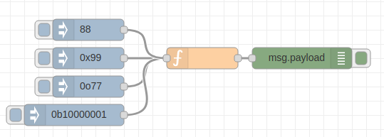

# node-vscp


Utility and constant package for VSCP programming with node.js

If you are new to VSCP you can find more info [here](https://www.vscp.org).


## Install
Install with

```bash
npm install node-vscp
```

optionally with '--save' to save dependency in the package.json file.

## Usage

Reference the module in the beghionning of your file like this

```
const vscp = require("node-vscp");
```

if you want to work with constants instead of _magical numbers_ then the vscp-class and vscp-type module is also useful. Bring them all in like this

```
const vscp_class = require('node-vscp-class');
const vscp_type = require('node-vscp-type');

const vscp = require("node-vscp");
```

## the VSCP Event class

This is a helper class that defines a VSCP event. You can use it in the following way

```
// Define event with object in constructor and data in array
e4 = new vscp.Event({
    vscpHead: 0,
    vscpClass: 10,
    vscpType: 6,
    vscpData: [15,14,13,12,11,10,9,8,7,6,5,4,3,2,0,0,1,35]
});
```

or 

```
// Define event with members
e2 = new vscp.Event();
e2.vscpClass = 10;
e2.vscpType = 6;
e2.data = [1,2,3,4,5];
```

The full definitions is like this

```
 * @param {object} options                              - Options
 * @param {number} options.vscpHead                     - Event head
 * @param {boolean} options.guidIsIpV6Addr              - GUID is a IPv6 address
 * @param {boolean} options.dumbNode                    - Node is a dumb node
 * @param {number} options.vscpPriority                 - Priority
 * @param {boolean} options.vscpHardCoded               - Hard coded node id
 * @param {boolean} options.vscpCalcCRC                 - Calculate CRC
 * @param {number} options.vscpClass                    - VSCP class
 * @param {number} options.vscpType                     - VSCP type
 * @param {number} options.vscpObId                     - Object id
 * @param {string} options.vscpDateTime                 - ISO UTC Date + time  
 * @param {number} options.vscpTimeStamp                - Timestamp
 * @param {string} options.vscpGuid                     - GUID string
 * @param {(number[]|string)} options.vscpData
```

### Methods

#### setIPV6Addr
Set bit in header that mark GUID as IP v6 address

#### isIPV6Addr
Check if GUID for this event is a IP v6 address or not. Return {boolean}*true* if it is.

#### setDumbNode
Set bit that mark this event as coming from a dumb node (No MDF, registers, nothing). 

#### isDumbNode
Check if this event is marked as coming from a dumb node. Return {boolean} *true* if it is.

#### setPriority
Set priority for the event (0-7). Lower value is higher priority.

#### getPriority
Get priority for event (0-7). Lower value is higher priority.

#### setHardCodedAddr
Set bit that mark this event as a hardcoded address.

#### isHardCodedAddr
Check if hardcoded address. 

#### setDoNotCalcCRC
Set bit that mark that no CRC calculations should be done. Typically used by some wireless nodes.

#### isDoNotCalcCRC
Return {boolean} *true* if no CRC calculations should be performed. Typically used by some wireless nodes.

#### getAsString
Get event in string form on the following format

```
vscpHead,vscpClass,vscpType,vscpObId,vscpDateTime,vscpTimeStamp,vscpGuid,vspData
```

This is the standard form to send events in the [VSCP tcp/ip link interface](https://docs.vscp.org/spec/latest/#/./vscp_over_tcp_ip).

#### setFromString
Set the event data from a text string on the following format

```
vscpHead,vscpClass,vscpType,vscpObId,vscpDateTime,vscpTimeStamp,vscpGuid,vspData
```

## Using with node-red

Node red allows for import of modules that can be then used in the function node. node-vscp is perfect for this.

First install the module (go to the **.node-red** folder)

```bash
npm install node-vscp
```

Add the module to the **settings.js** file (also in the .node-red folder).

```javascript
functionGlobalContext: {
    vscp:require('node-vscp')
}
```

Now restart node-red with

```
systemctl restart nodered
```
When node-red comes up again you are ready to make node functions that use the vscp helper code. One of the functions in the module is **readValue** which accepts a string coded as a decimal, hex, octal or binary number and output the result as a decimal number.

```javascript
var val = global.get('vscp').readValue(msg.payload)
msg.payload = val;
return msg;
```

will convert anything that is inputted into the node (must be a string).

We can now use an inject node and input hex values (preceded with '0x'. octal values (preceded with 0o), binary values (preceded with 0b) or decimal values as they are (but on string form).



The output is sent to a debug node so we can investigate the result. 

This flow is defined as

```javascript
[
    {
        "id": "e12ba6da.b3f8e",
        "type": "tab",
        "label": "Flow 2",
        "disabled": false,
        "info": ""
    },
    {
        "id": "5be7bfca.2fd2d",
        "type": "function",
        "z": "e12ba6da.b3f8e",
        "name": "",
        "func": "var val = global.get('vscp').readValue(msg.payload)\nmsg.payload = val;\nreturn msg;",
        "outputs": 1,
        "noerr": 0,
        "x": 290,
        "y": 160,
        "wires": [
            [
                "d5c9e3bb.0ea208"
            ]
        ]
    },
    {
        "id": "d5c9e3bb.0ea208",
        "type": "debug",
        "z": "e12ba6da.b3f8e",
        "name": "",
        "active": true,
        "tosidebar": true,
        "console": false,
        "tostatus": false,
        "complete": "false",
        "x": 430,
        "y": 160,
        "wires": []
    },
    {
        "id": "587eb6fe.02125",
        "type": "inject",
        "z": "e12ba6da.b3f8e",
        "name": "",
        "topic": "",
        "payload": "0x99",
        "payloadType": "str",
        "repeat": "",
        "crontab": "",
        "once": false,
        "onceDelay": 0.1,
        "x": 130,
        "y": 160,
        "wires": [
            [
                "5be7bfca.2fd2d"
            ]
        ]
    },
    {
        "id": "a281b107.456158",
        "type": "inject",
        "z": "e12ba6da.b3f8e",
        "name": "",
        "topic": "",
        "payload": "0o77",
        "payloadType": "str",
        "repeat": "",
        "crontab": "",
        "once": false,
        "onceDelay": 0.1,
        "x": 130,
        "y": 200,
        "wires": [
            [
                "5be7bfca.2fd2d"
            ]
        ]
    },
    {
        "id": "ba40637f.166d08",
        "type": "inject",
        "z": "e12ba6da.b3f8e",
        "name": "",
        "topic": "",
        "payload": "0b10000001",
        "payloadType": "str",
        "repeat": "",
        "crontab": "",
        "once": false,
        "onceDelay": 0.1,
        "x": 110,
        "y": 240,
        "wires": [
            [
                "5be7bfca.2fd2d"
            ]
        ]
    },
    {
        "id": "e7d02888.b2e228",
        "type": "inject",
        "z": "e12ba6da.b3f8e",
        "name": "",
        "topic": "",
        "payload": "88",
        "payloadType": "str",
        "repeat": "",
        "crontab": "",
        "once": false,
        "onceDelay": 0.1,
        "x": 130,
        "y": 120,
        "wires": [
            [
                "5be7bfca.2fd2d"
            ]
        ]
    }
]
```

well this is not so revolutionary code by you probably get what can be done.

---

This package is part of the [VSCP(Very Simple Control Protocol)](https://www.vscp.org) IoT framework.


